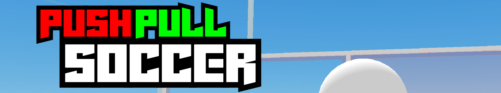

# REDBRICK

## 만든 게임들
| | |
| --- | --- |
|  | |

## 소개
REDBRICK Studio에서 사용하는 API와 모듈을 이해하고 활용하기 위해 제작된 게임들입니다.
> PUSHPULL SOCCER : Threejs에 대한 적응과 Timer 모듈과 물리 처리에 대한 매소드 사용을 목표로 하여 제작했습니다.

> P0rta! : TWEEN을 활용한 애니메이션 구현을 목표로 하여 제작했습니다.

___

REDBRICK Studio에서 Javascript를 사용해서 만든 첫 프로젝트입니다.  
루시우볼을 모티브로 제작했기 때문에 물리 처리 매소드를 주로 사용한 게임입니다.  

> 핵심 코드

### Managers
사운드, UI, 카메라 등을 제어하는 Class가 정의 및 초기화된 스크립트입니다.  

사운드, UI, 카메라 등을 다른 스크립트에서 접근하여 손쉽게 사용할 수 있도록 GLOBAL 객체를 사용하여 전역에서 접근할 수 있게 해주었습니다.

### ObjectPool
SCENE에 생성되어 있는 동일한 프로퍼티 값을 가진 오브젝트를 관리해주는 스크립트입니다.  
   
현재 REDBRICK Studio 자체에서 스크립트를 통해 객체를 복사할 때, 물리와 관련된 컴포넌트는 복사가 되지 않기 때문에 미리 SCENE에 생성해두고 ObjectPool 내부에 넣어 관리할 수 있도록 하였습니다.   
  
ObjectPool 클래스를 상속받는 CannonPool 클래스를 통해 PLAYER가 캐논 볼을 쏠 수 있게 해줍니다.

### GameManager
게임의 흐름을 제어하는 스크립트입니다.
  
PLAYER의 시작위치, 라운드 시간(Timer)과 각 팀별 스코어 등을 관리해줍니다.
  
### PlayerController
PLAYER의 위치 초기화, 캐논 볼 발사를 처리해주는 스크립트입니다.

___

Portal 1을 모티브로 제작한 게임입니다. TWEEN을 통한 애니메이션을 사용한 게임입니다.

> 핵심 코드

### ClassAssemble
맵을 구성하는 오브젝트에 대한 Class가 작성된 스크립트입니다. 

static Factory Method를 사용하여 GLOBAL 객체에 생성자 함수를 전달하여 다른 스크립트에서도 해당 클래스를 생성할 수 있게 하였습니다.

클래스를 수정해도 오브젝트에 부착된 스크립트는 수정되지 않도록 Update 매소드를 따로 안에 넣어 관리해주었습니다.

#### InteractBox
PLAYER가 상호작용할 수 있는 상자입니다. 오브젝트에 부착되어 개별적으로 역할을 수행합니다. 상자를 들었을 때, 설정되는 위치는 PlayerController에서 Update되고 있는 위치(selectPosition)입니다.
#### Button
PLAYER 또는 상자와 상호작용하여 동작하는 버튼입니다. PLAYER와의 상호작용은 거리를 통해 동작하고, 상자와의 상호작용은 충돌 처리를 통해 동작합니다. 충돌 처리시에 특정 객체에 대해서만 처리하기 때문에 상자와 1:1로 연결해주었습니다.
#### Door
PLAYER 또는 버튼과 상호작용하여 동작하는 문입니다. PLAYER와의 상호작용은 거리를 통해 동작하고, 버튼과의 상호작용은 버튼에 정의된 isPressed 프로퍼티를 통해 동작합니다. 문이 버튼과 연결된 경우, PLAYER에 대한 상호작용은 비활성화됩니다.

### PortalGun
포탈건의 위치와 포탈의 생성 위치 및 포탈을 통한 이동을 처리해주는 스크립트입니다.
  
Raycast와 그 결과값인 intersects를 사용하여 포탈의 생성 위치를 설정해줍니다.

### PlayerController
포탈의 발사와 카메라의 forward Vector를 통해 상자를 들었을 때의 위치를 처리해주는 스크립트입니다.